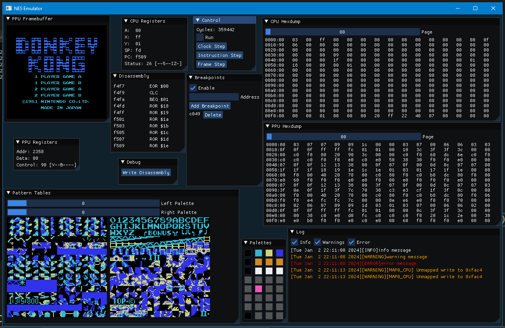

# NES Emulator

Work in progress NES emulator

Progress so far:

1. All official 6502 opcodes implemented
2. Ability to interpret machine code
3. Disassembler
4. Basic GUI
5. Pattern table and palette displays



# Building
This project uses [Premake](https://premake.github.io/download) to generate build files. You will need to download an executable for your platform and add it to your PATH environment variable.

## Windows
The included premake script supports both MSVC and MinGW-w64 (gcc).

### Visual Studio
1. Run the premake action:
```
premake5 vs2022
```
(replace the version of Visual Studio with what you have installed)

2. Use the generated Visual Studio solution as normal.

### MinGW-w64
1. Run the premake action:
```
premake5 gmake2
```
2. Build the project with:
```
make
```
This will build the project in a debug configuration. You can specify which version to build using:
```
make config=release
make config=debug
```
3. The executable will be in `/bin/Debug/` or `/bin/Release`.

## Linux
The premake script does support linux but you will need to install GLFW yourself. So far, I have only tested it with Ubuntu under WSL2 (lol).
1. Obtain the GLFW from your package manager. For Ubuntu based distros:
```
sudo apt install libglfw3
sudo apt install libglfw3-dev
```
2. Run the premake action:
```
premake5 gmake2
```

3. Build the project with:
```
make config=release
make config=debug
```

4. The executable will be in `/bin/Debug/` or `/bin/Release/`